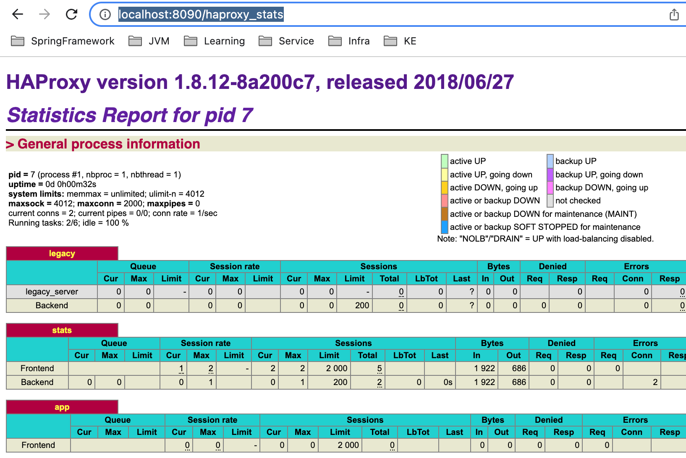

# Play HAProxy

GOAL. HAProxy 설정에 따라 어떻게 동작하는지 살펴보자

# STEP

## HAProxy 를 띄워보자

### 공식 이미지 페이지 설명을 보면서 따라하기

이미지 만들기(OUTDATED)
```shell
$ docker build -t my-haproxy .
```

설정 파일 검증(OUTDATED)
```shell
$ docker run -it --rm --name haproxy-syntax-check my-haproxy haproxy -c -f /usr/local/etc/haproxy/haproxy.cfg
```

RUN(OUTDATED)
```shell
$ docker stop my-running-haproxy || true && docker rm -f my-running-haproxy || true
$ docker run -d --name my-running-haproxy -p 8080:80 -p 8090:8090 --sysctl net.ipv4.ip_unprivileged_port_start=0 my-haproxy
```
- 이미 실행중인 경우, 실행중인 컨테이너를 삭제하는 코드 추가 [참고](https://stackoverflow.com/a/38225298)

아래 에러 발생
```
2023-03-21 20:03:36 [ALERT] 079/110336 (1) : [haproxy.main()] No enabled listener found (check for 'bind' directives) ! Exiting.
```

### 최소 설정과 웹 서버 구축
인터넷 검색해서 최소한의 HAProxy 설정을 가져옴.

Python 으로 server 폴더에 8000 포트로 서버를 하나 띄워봄
```shell
$ cd server
$ python3 -m http.server 8000
```

그리고 HAProxy 서버가 위 서버를 바라보도록 설정

설정 파일 검증에서 에러 발생
```
[ALERT] 079/112528 (1) : parsing [/usr/local/etc/haproxy/haproxy.cfg:13] : 'frontend' cannot handle unexpected argument '*:80'.
[ALERT] 079/112528 (1) : parsing [/usr/local/etc/haproxy/haproxy.cfg:13] : please use the 'bind' keyword for listening addresses.
[ALERT] 079/112528 (1) : Error(s) found in configuration file : /usr/local/etc/haproxy/haproxy.cfg
[ALERT] 079/112528 (1) : Fatal errors found in configuration.
```

[인터넷 검색 해보니 문법이 변경되었다고 함.](https://superuser.com/a/1092793)

수정 후 검증 패스
```
Configuration file is valid
```

수정후, 8000 포트로 HAProxy 통해서 HttpServer 에 접속 성공

볼륨 마운트 후, 설정 파일 수정하면, 아래 명령으로 설정 파일만 적용 가능하다고 함
```shell
$ docker kill -s HUP my-running-haproxy
```

### HAProxy 상태를 확이할 수 있도록 stats 를 열어보자


바로가기: http://localhost:8090/haproxy_stats

### Docker-compose 로 재구성
수정 및 재시작이 번거로워서 Docker-compose 로 재구성함

- 웹서버를 Apache Httpd 이미지로 변경


## Link
- [Docker Image](https://hub.docker.com/_/haproxy)
